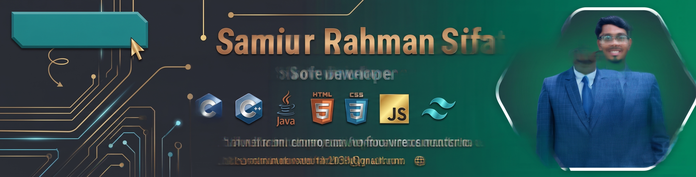

  

# Hi 👋, I'm Samiur Rahman Sifat
### 🔭 A passionate full-stack developer from Dhaka, Bangladesh

---

## 👨‍💻 About Me
I am a 4th-semester CSE student at North South University, passionate about AI-driven Full Stack Development, Machine Learning, and competitive programming in C++. Currently, I am strengthening my foundations through Programming Hero's web development track, turning fundamentals into real, working projects before scaling up my tech stack. Always eager to learn, build, and solve!

---

## 🛠️ Tech Stack

### **Languages & Frontend**

### **Core Programming**

### **Tools & Environment**

---

## 🌐 Connect With Me

---

## 📊 GitHub Stats

  
  

  

---

  

